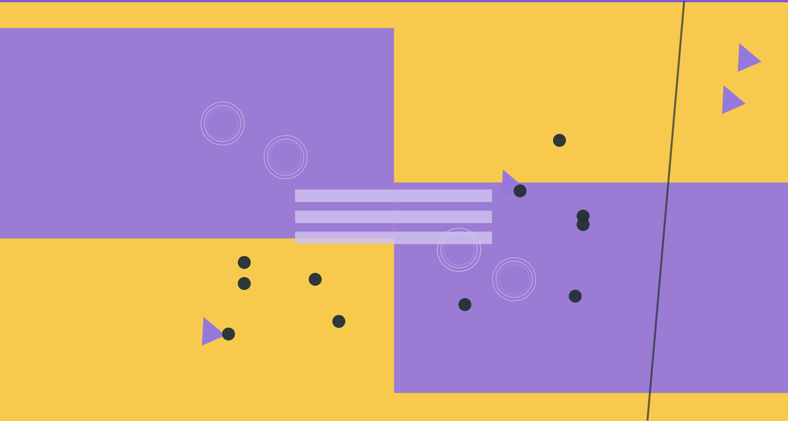

# Visual Sound 🎨🎵

## An online VJ/DJ Machine and Social Platform.   

> [Demo](https://visual-sound-db.web.app/)

- An **audio-visual instrument** that creates animation through the **keyboard** and buttons.
- Members could browse others’ creations, and interact by **liking**, **commenting**, or **saving to collections**. 
- **Following** and sending **direct messages** is also supported.

 

  
Table of Contents

  <ol>
    <li>
      <a href="#about-the-project">About The Project</a>
      <ul>
        <li><a href="#built-with">Built With</a></li>
      </ul>
    </li>
    <li><a href="#flowchart">Flowchart</a></li>
    <li><a href="#demo">Demo</a>
    <li><a href="#future-features">Future Features</a></li>
    <li><a href="#contact">Contact</a></li>
    <li><a href="#acknowledgments">Acknowledgments</a></li>
  </ol>

 

## About The Project

### Built With

* [React.js](https://reactjs.org/)

## Flowchart
## Demo 

[Demo Video](https://www.linkedin.com/in/jia-rong-tsai/)

## Future Features

##  Contact

Created by [@jiarongtsai](https://github.com/jiarongtsai) - feel free to contact me!

[Linkedin](https://www.linkedin.com/in/jia-rong-tsai/)

##  Acknowledgements

This project was inspired by [patatap](https://patatap.com/) and [beact](https://beact.herokuapp.com/).

<a href="#top">back to top</a>

