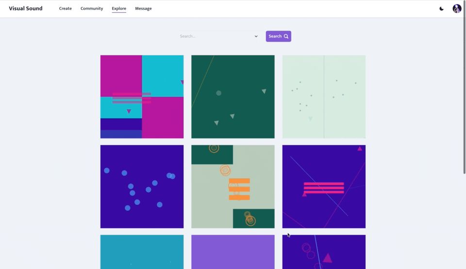
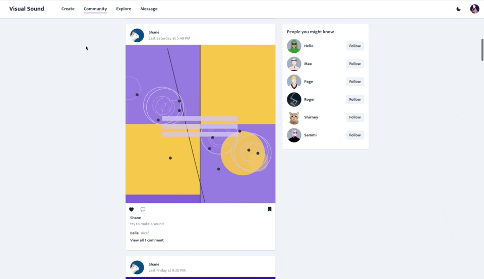
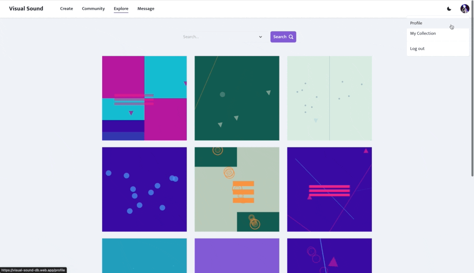
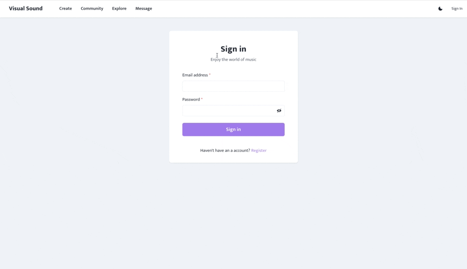

# Visual Sound 🎨🎵

## An online VJ/DJ Machine and Social Platform.   

> [Demo](https://visual-sound-db.web.app/)

- An **audio-visual instrument** that creates animation through the **keyboard** and buttons.
- Members could browse others’ creations, and interact by **liking**, **commenting**, or **saving to collections**. 
- **Following** and sending **direct messages** are also supported.

 

  
Table of Contents

  <ol>
    <li>
      <a href="#technologies">Technologies</a>
    </li>
    <li>
      <a href="#performance-tuning">Performance Tuning</a>
    </li>
    <li><a href="#flow-chart">Flow Chart</a></li>
    <li><a href="#features">Features</a><ul>
        <li><a href="#music-production">Music Production</a></li>
        <li><a href="#social-interaction">Social Interaction</a></li>
      </ul></li>
    <li><a href="#future-improvement">Future Improvement</a></li>
    <li><a href="#contact">Contact</a></li>
    <li><a href="#acknowledgments">Acknowledgments</a></li>
  </ol>

 

## Technologies

### Front-End Fundamental
  - HTML / CSS / JavaScript
  - Responsive Web Design (RWD)
### Back-End Service
  - [Firebase](https://firebase.google.com/) (Database, Storage, Authentication, and Hosting)
### Frameworks & Libraries  
  - [React.js](https://reactjs.org/) (Hooks)
  - [React Router](https://reactrouter.com/) 
  - [Tone.js](https://tonejs.github.io/)
  - [Chakra-ui](https://chakra-ui.com/) / [Emotion](https://emotion.sh/docs/styled) / [Framer-motion](https://www.framer.com/motion/) 
  - [Html2canvas](https://html2canvas.hertzen.com/)
### Packages
  - [React-icons](https://react-icons.github.io/react-icons/)
  - [React-joyride](https://react-joyride.com/)
  - [React-firebase-hooks](https://firebaseopensource.com/projects/csfrequency/react-firebase-hooks/)
  - [Prop-types](https://www.npmjs.com/package/prop-types)
  - [React-spring](https://react-spring.io/) 
  - [Chakra-react-select](https://www.npmjs.com/package/chakra-react-select)
  - Replaced [Moment](https://momentjs.com/) with [Day.js](https://day.js.org/en/) (2022/06)
  - Replaced [@ajna/pagination](https://www.npmjs.com/package/@ajna/pagination) with Chakra-ui components (2022/06)

### Development tools  
  - [Prettier](https://prettier.io/) / [Husky](https://typicode.github.io/husky/#/) 

 

## Performance Tuning 

- Reduce bundle size. ( from 2.1MB to 1.9MB )
- Implement code-splitting. ( with `Suspend` and `lazy()` )
- Use `React.memo` to reduce unnecessary re-render.
- Apply **debounce** method on BPM Value controller.

### Web Vital 
- Set minimum height for images. ( Cumulative Layout Shift, CLS )
- Added `alt` tags for all images. (SEO)

 

## Flow Chart

 

## Features 

### Music Production 
Home (Create Page)
- Record music by pressing a key or button.
- Change theme color and bpm.
- Upload works.

### Social Interaction

Explore Page
- Browse works and search works by tags.
- Interact with works.
- View other users.
- Follow/unfollow or send messages to the user.
- Chat with others.

Community Page
- Interact with works and users instantly.

Profile Page
- Check the profile page.
- View the collection.

Message Page
- Chat with other users.
- Open chatrooms.

Register / Login
- Validation.

RWD / Dark mode

  

 

[Features Demo Video](https://drive.google.com/file/d/1miDf0MIJI1NZqVNSte1aQ9Osrxpnb5uM/view?usp=sharing) (Mandarin)

 

## Future Improvement

### Visual 
- Trigger music by screen touching.
- Customize theme color.
- Create 3D visual elements.

### Sound
- Implement melody instruments.
- Record 16-32 scale (a song).
- Allow mixing and mastering.

### Social Interaction
- Build notification system.
- Share works on message.
- Co-editing.

 

##  Acknowledgements

inspired by [patatap](https://patatap.com/) and [beact](https://beact.herokuapp.com/).

 

##  Contact

Welcome for any suggestion or collaboration, feel free to contact me! 

Created by **Bella** [@jiarongtsai](https://github.com/jiarongtsai)  
[jiarongtsai19@gmail.com](mailto:jiarongtsai19@gmail.com) | [Linkedin](https://www.linkedin.com/in/jia-rong-tsai/) |
[Facebook](https://www.facebook.com/jiarongtsaiBella/)

 

 🎨🎵 Hope you have fun with [Visual Sound](https://visual-sound-db.web.app/).

<a href="#top">back to top</a>

